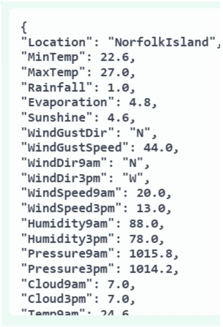
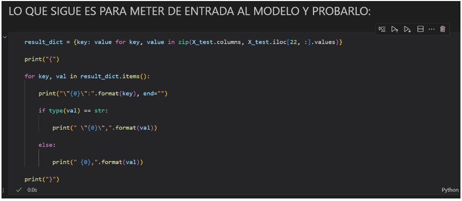
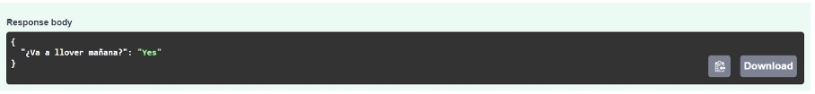

# TP
### AMq2 - CEIA - FIUBA
Estructura de servicios para la implementación del proyecto final de AMq2 - CEIA - FIUBA

Los servicios que se usaron son:
- [Apache Airflow](https://airflow.apache.org/)
- [MLflow](https://mlflow.org/)
- API Rest para servir modelos ([FastAPI](https://fastapi.tiangolo.com/))
- [MinIO](https://min.io/)
- Base de datos relacional [PostgreSQL](https://www.postgresql.org/)


Buckets utilizados (no se agregan nuevos):

- `s3://data`
- `s3://mlflow` (usada por MLflow para guardar los artefactos).

Bases de datos (no se agregan nuevas):

- `mlflow_db` (usada por MLflow).
- `airflow` (usada por Airflow).

## Tarea realizada

- Se implemento un DAG en Apache Airflow que realiza un proceso ETL.
- Un experimento en MLflow de búsqueda de hiperparámetros.
- Se servio el modelo implementado en AMq1 en el servicio de RESTAPI.

## Instalación

1. Para poder levantar todos los servicios, primero instala [Docker](https://docs.docker.com/engine/install/) en tu 
computadora (o en el servidor que desees usar).

2. Clona este repositorio.

3. Si estás en Linux o MacOS, en el archivo `.env`, reemplaza `AIRFLOW_UID` por el de tu 
usuario o alguno que consideres oportuno (para encontrar el UID, usa el comando 
`id -u <username>`). De lo contrario, Airflow dejará sus carpetas internas como root y no 
podrás subir DAGs (en `airflow/dags`) o plugins, etc.

4. En la carpeta raíz de este repositorio, ejecuta:

```bash
docker compose --profile all up
```

5. Una vez que todos los servicios estén funcionando (verifica con el comando `docker ps -a` 
que todos los servicios estén healthy o revisa en Docker Desktop), podrás acceder a los 
diferentes servicios mediante:
   - Apache Airflow: http://localhost:8080
   - MLflow: http://localhost:5000
   - MinIO: http://localhost:9001 (ventana de administración de Buckets)
   - API: http://localhost:8800/
   - Documentación de la API: http://localhost:8800/docs

Si estás usando un servidor externo a tu computadora de trabajo, reemplaza `localhost` por su IP 
(puede ser una privada si tu servidor está en tu LAN o una IP pública si no; revisa firewalls 
u otras reglas que eviten las conexiones).

## Uso

1.   Utilizar el notebook notebook_example/aprMaqI_CEIA_co14.ipynb para cargar el modelo a MLflow. Este notebook realiza los siguientes pasos:
   - Carga los datos a un dataframe de pandas.
   - Se hace una preparación de los datos.
   - Se entrena el modelo.
   - Se calculan algunas métricas del modelo.
   - Se almacena el modelo y las métricas en Mlflow, con los siguientes pasos:
      - Se crea un experimento.
      - Se crea un run.
      - Dentro de este run se almacenan las métricas y el modelo.
      - Se crea un nuevo run y se registra el modelo con la etiqueta “Champion”, esta   etiqueta la usaremos para cargar el modelo cuando lo utilicemos en la API.

2.   Para realizar una busqueda de hiperparametros se utiliza el archivo notebook_example/hyperparameter_mlflow.py. Se registra el modelo y sus métricas en Mlflow, y además, se registra el modelo en el registro de modelos de Mlflow.

3.   Uso de la API: Se utiliza el modelo de aprendizaje de máquina 1, se toma el artefacto de Mlflow y lo expone para realizar predicciones (por esta razón, para probar la API hace falta primer correr el notebook notebook_example/aprMaqI_CEIA_co14.ipynb para tener disponible el modelo en mlflow). Formas para probar el modelo:
   - Por medio de la UI.
      - Acceder a http://localhost:8800/docs (hay que tener el contenedor corriendo).
      - Usar el metodo POST.
        
      - Dar en el botón Try it out.
        
      - Ingresar los datos para realizar la predicción (formato de diccionario).
        
      - Para obtener estos diccionario de forma rápida se puede usar el codigo en el notebook aprMaqI_CEIA_co14 (eliminar la ultima coma que genera este codigo).
        
      - Dar al botón Execute.
        
      - Obtenemos la predicción.
        
   - A través del notebook dockerfile/fastapi/testing_api.ipynb.
      - Correr el comando uvicorn app:app --host 0.0.0.0 --port 8000 en el directorio donde esta el archivo app.py.
      - Usar el notebook dockerfile/fastapi/testing_api.ipynb.

4.   En la carpeta dags tenemos un archivo .py que ejecuta un proceso ETL. Los pasos realizados son:
   - Extract: obtiene el los datos desde un archivo .csv y almacena estos datos crudos en el bucket “data” de minio, también se almacena un archivo .JSON con datos del            dataset. Se hace seguimiento en Mlflow de esta parte, se almacenan algunos datos que se considerarán de interés.
   - Transform: Realiza limpieza y feature engineering, divide el dataset y lo almacena de el mismo bucket, en archivos separados.
   - Load: Cargamos los datos y mostramos las dimensiones.
              

